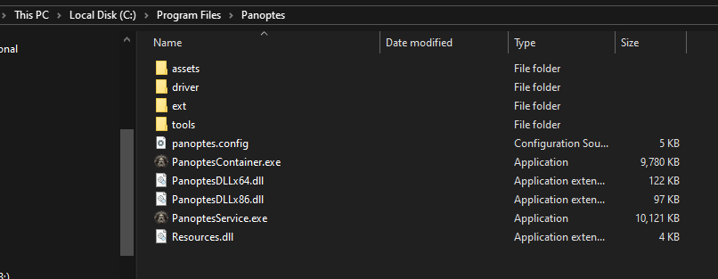

# Panoptes Endpoint Detection and Response

<p align="center">
<br />
</p>

## Overview

Panoptes is an Endpoint Detection and Response (EDR) system designed for educational purposes to understand Windows Kernel Drivers, ETW, and Windows system interactions. **This is not intended for production use.**

## Demo

[Link to video](https://youtu.be/U_L-zY7IxYM)

## Features

- MSI installer for easy installation and removal
- Persistent storage using RocksDB for improved response time
- JSON-formatted logs compatible with ELK, [HELK](https://github.com/Cyb3rWard0g/HELK), and other SIEM solutions
- Kernel-level DLL injection using Kernel Asynchronous Procedure Call (kAPC)
- Kernel Callbacks monitoring:
  - Process Creation
  - DLL loading
  - Kernel Driver loading
  - Thread/Process/Desktop handle operations
- Userland NTAPI function hooks
- Static Analysis using Yara-X with ability to use custom rules
- PE file analysis (Headers, Digital Signatures, Sections) using LIEF
- AMSI scanning integration
- JSON configuration file with built-in linter
- Right-click context menu integration
- Command-line interface for scanning
- Comprehensive unit testing using Google Tests (IN PROGRESS)

## About the Name

Panoptes, meaning "all-seeing," comes from Greek mythology. Argus Panoptes was a giant with a hundred eyes who served as a guardian to the Greek Gods. [Learn more about Argus Panoptes](https://en.wikipedia.org/wiki/Argus_Panoptes)

## Architecture

Panoptes is designed with flexibility in mind, allowing users to customize deployment through a JSON configuration file. Panoptes is also packaged using [Wix Toolset](https://www.firegiant.com/wixtoolset/) MSI file for easy installation and uninstallation.

<p align="center">
<br />
</p>

The system uses gRPC for communication between the main service, containers, and tools. The kernel component is configured as an ETW provider, enabling real-time event monitoring and scan queuing.

## Core Components

### Kernel Driver Callbacks

The kernel driver implements several callbacks for system event monitoring:
- Process creation/termination
- Module/driver loading 
- Process handle operations (**IN PROGRESS**)
- Registry modifications (**IN PROGRESS**)

Currently implemented:
- PsSetCreateProcessNotifyRoutineEx
- PsSetLoadImageNotifyRoutine

Planned implementations:
- ObRegisterCallbacks
- CmRegisterCallbackEx
- PsSetCreateThreadNotifyRoutine

**Note: Currently the kernel driver is hardcoded to only inject the hooking DLL into Detect it Easy (die.exe)**

### Userland Hooks

Panoptes injects a DLL module into processes during early creation stages using kernel-level injection. This ensures comprehensive event capture from process start to finish. Current API hooks include:
- NtWriteVirtualMemory
- NtModifyBootEntry
- NtMapViewOfSectionEx
- NtMapViewOfSection
- **MORE TO BE ADDED**

### Extensibility Modules

Panoptes uses a container-based architecture for its modules, providing:
- Fault isolation
- Improved stability
- Easy module addition
- Better resource management
- Parallel processing capabilities

#### Core Modules

1. **PanoptesYara**
   - Core detection module
   - Uses [VirusTotal/Yara-X](https://github.com/VirusTotal/yara-x)
   - Supports custom compiled rules
   - Compatible with [awesome-yara](https://github.com/InQuest/awesome-yara) rules or many others

2. **PanoptesPE**
   - PE file analysis module
   - Uses [LIEF Project](https://github.com/lief-project/LIEF)
   - Provides detailed binary analysis
   - Supports multiple binary formats in future Panoptes may be supported on other operating systems

3. **PanoptesAMSI**
   - Optional AMSI integration
   - Uses AmsiScanBuffer
   - Compatible with existing antivirus solutions
   - Not an AMSI Scan Provider

## Installation

1. Download the MSI installer from the Releases page
2. To use the Panoptes Kernel Driver ensure that testsigning is enabled using the following command:
   ```powershell
   bcdedit /set TESTSIGNING ON
   ```
   Then restart your system
3. Run the MSI installer
4. Place compiled Yara-X rules in `C:\Program Files\Panoptes\`
5. Start `PanoptesService.exe` as Administrator


### Compiling Custom Rules

```powershell
yr.exe compile <PATH_TO_YARA_RULES_FOLDER> -o rules.pkg
```

## Usage

- Right-click files to scan
- Use command-line interface for batch scanning
- Monitor notifications for detections
- Check quarantine folder: `C:\ProgramData\Panoptes\Quarantine`
- View logs: `C:\ProgramData\Panoptes\Logs`

## Development Setup

Required tools:
- [Vcpkg](https://vcpkg.io/en/)
- [LIEF Project](https://github.com/lief-project/LIEF)
- Visual Studio with Windows Driver Kit
- Test signing enabled
- Virtual Machine configured for Windows Kernel Debugging using Windbg

For kernel development environment setup, see:
- [Ap3x/Windows-Kernel-Development-Infrastructure](https://github.com/Ap3x/Windows-Kernel-Development-Infrastructure)
- [Microsoft WDK Installation Guide](https://learn.microsoft.com/en-us/windows-hardware/drivers/download-the-wdk)

### CMake Build Options

The following CMake options are available during configuration:

- `BUILD_DOC` (OFF by default): Build Doxygen documentation
- `BUILD_WIX_INSTALLER` (OFF by default): Build the Wix MSI installer package
- `BUILD_DRIVER` (OFF by default): Build the kernel driver package
- `BUILD_GRPC` (OFF by default): Generate gRPC code from protobuf definitions

Example CMake configuration:
```powershell
mkdir build
cd build 
cmake --preset debug -DBUILD_DOC=ON -DBUILD_DRIVER=ON -DBUILD_WIX_INSTALLER=ON ..
cd debug
msbuild /p:Configuration=Debug Panoptes.sln
```

## Screenshots of Panoptes Features
### Scanning and Detecting Malicious Activity Notification

<p align="center" >
<br />
</p>

<p align="center" >
<br />
</p>

### MSI Installer 

<p align="center" >
<br />
</p>


<p align="center" >
<br />
</p>

<p align="center" >
<br />
</p>

### Installed Locations

<p align="center" >
<br />
</p>


<p align="center" >
<br />
</p>

### Easily Uninstall in App and Programs Menu in Settings

<p align="center" >
<br />
</p>

## Roadmap

- [ ] Component-specific documentation
- [ ] Add more NTDLL hooks for monitoring

## References

- [Kernel Callback Functions](https://codemachine.com/articles/kernel_callback_functions.html)
- [EDR Kernel Callbacks](https://pre.empt.blog/2023/maelstrom-5-edr-kernel-callbacks-hooks-and-call-stacks)
- [Windows EDR Telemetry](https://www.edr-telemetry.com/windows)
- [ETW Events Overview](https://artefacts.help/windows_etw_overview.html)
- [Windows Security Event IDs](https://www.ultimatewindowssecurity.com/securitylog/encyclopedia/default.aspx)
- [LOL Drivers Yara Rules](https://github.com/magicsword-io/LOLDrivers/tree/main/detections/yara)
- [Installing Test Certifications](https://learn.microsoft.com/en-us/windows-hardware/drivers/install/installing-test-certificates)


